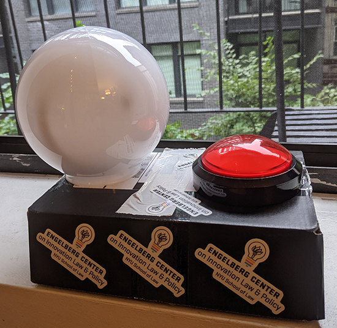

# Lightning Talk Countdown Timer

This is a timer that we used for the introductory Engelverse lightning talk happy hour in the fall of 2021.  It consists of a glowing globe and a big red button.  Pushing the button begins a one minute countdown sequence.  For the first 45 seconds the globe glows green.  In the last 15 seconds the globe begins flashing yellow, then switches to a rainbow pattern, and ultimately solid red.  The switch to red is accompanied by a buzzer, although it was too faint to be heard outside of the case.

The parts required for the buzzer are:

* A button
* An Adafruit Circuit playground (although anything that can run micropython should work)
* A globe (we used a 6" frosted plastic globe)
* A strip of neopixels
* A power source (we used a USB power brick in order to make it portable)

Here is the wiring diagram:

A few things to note:

* the labels on the circuit playground express pins do not quite match the current versions.  The placement of the wires is correct even though the number may be wrong in that image. The proper pin connections are A5 for the button and A2 for the neopixels:

* You need a switch set so that pushing the button interrupts the current. That usually requires switches with three terminals.

* The code is largely modified from various Adafruit circuit playground examples.  All original code, along with documentation and images is licensed under the CERN-OHL-P-2.0 license.

Enjoy!
